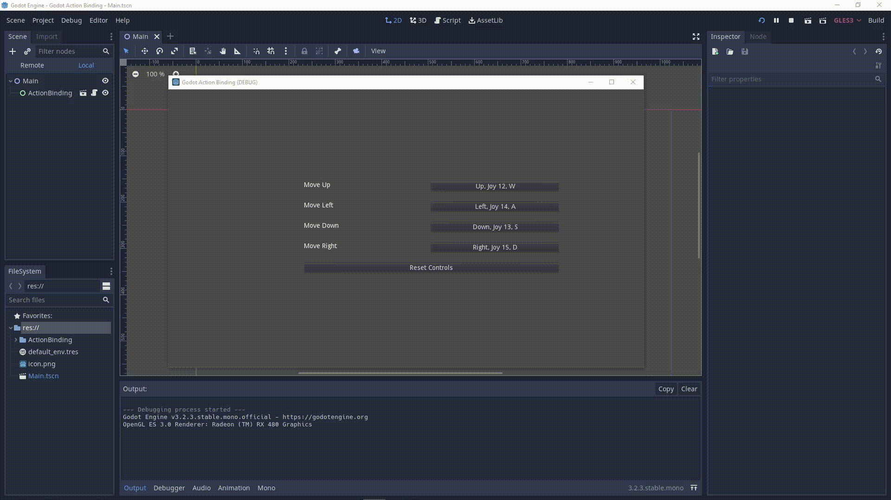

## Godot Action Binding

To test, simply download and run in Godot

### About

This repo makes input/control/key/action rebinding a simple drag+drop into Godot C# projects (with some optional configuration). 

### Features

- Rebind actions to a new inputs
- Mappings are saved to custom file automatically, no need to clutter your save files!
- Reset Mappings to their defaults with a button click
- Display the multiple default inputs on mapping button

#### To Do

- Enable rebinding to multiple inputs
- Improve display/wording of gamepad inputs

### How to use

1. Drag the ActionBinding folder into your project
2. Place the ActionBindingMenu.tscn scene into one of your scenes
3. Add your actions+bindings to your project setting's InputMap (through the Godot Editor)
4. In ActionBindingMenu.cs, edit the ReassignableActions dictionary to only include the actions you want the user to be able to re-assign. Edit the save file path too if you like
5. IMPORTANT: In ControlRebindingInput.cs, edit the RES_PATH to match where you dropped ControlRebindingInput.tscn into your project
6. IMPORTANT: This repo relies on the Newtonsoft.Json nuget package. If you are missing Newtonsoft.Json in your Godot project, install it via `dotnet add package Newtonsoft.Json --version 12.0.3`
7. Run!
8. Update `EventSimpleText(InputEvent e)` in ActionBindingMenu.cs to change the control's text output

#### License

MIT
